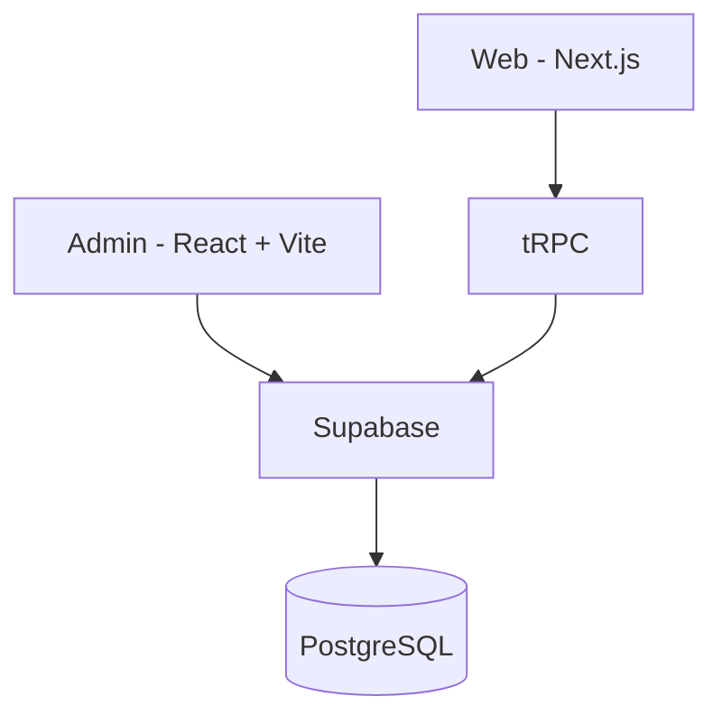

# I'm Jung

## 📌 프로젝트 소개

<div align="center">
  
</div>

### 개인 브랜딩과 기록을 위한 디지털 공간

개발자의 개인 브랜딩과 기록을 위한 디지털 공간으로, 블로그, 갤러리, 방명록 등 다양한 소통 기능을 제공하는 풀스택 웹 서비스입니다. 기획부터 디자인, 프론트엔드 및 백엔드 개발까지 전반을 담당한 1인 풀스택 프로젝트입니다.

### 주요 기능

- **갤러리**: 사진 컬렉션 관리 및 공유 시스템
- **스팟**: 장소 정보 및 리뷰 플랫폼
- **블로그**: 개발 경험과 지식 공유 공간
- **방명록**: 방문자와의 소통 공간

</br>

## 🛠 기술 스택

### Frontend (Web)

- Next.js 14 (App Router)
- TypeScript
- TanStack Query
- tRPC Client
- Vanilla Extract
- Framer Motion

### Frontend (Admin)

- React 18
- Vite
- TypeScript
- TanStack Query & Router & Table
- Vanilla Extract
- Supabase Client

### Backend

- tRPC
- Supabase

### DevOps & Tools

- Vercel (Web)
- Vercel (Admin)
- pnpm
- Turborepo
- Biome
- Husky
- GitHub Actions
- Vitest (Unit Testing)
- Storybook & Chromatic

</br>

## 🏗 시스템 아키텍처


</br>

## 📦 Monorepo 구조

```bash
apps/
  ├── web/           # 메인 웹사이트 (Next.js)
  ├── admin/         # 관리자 페이지 (React + Vite)
  ├── server/        # tRPC API
  └── workshop/     # UI 컴포넌트 문서화
packages/
  ├── configs/       # 테스트코드 설정 파일
  ├── design-system/ # 디자인 시스템      
  ├── shared/        # 공유 타입 및 유틸리티
  └── typescript-config # 타입스크립트 설정 파일
```

</br>

## 💻 개발 환경 설정

1. 저장소 클론

```bash
git clone https://github.com/dgd03146/jung.git
cd jung
```

2. 환경 변수 설정

```bash
cp .env.example .env
```

3. 의존성 설치

```bash
pnpm install
```

4. 개발 서버 실행

```bash
pnpm run dev
```

</br>

## 🌐 배포 정보

- 프로덕션: <https://www.geojung.com/>
- 스토리북: <https://664d5ae9bd834c32cc784632-uwgqtjvjge.chromatic.com/>

</br>

## 📝 Git 컨벤션

### 브랜치 전략

- main: 프로덕션 브랜치
- develop: 개발 브랜치
- release/*: 릴리즈 브랜치
- feature/*: 기능 개발
- hotfix/*: 긴급 수정

### 커밋 메시지

```
feat: 새로운 기능
fix: 버그 수정
docs: 문서 수정
design: 디자인 수정
style: 코드 포맷팅
rename: 파일 혹은 폴더명을 수정하거나 옮기는 작업
refactor: 코드 리팩토링
test: 테스트 코드
chore: 기타 변경사항
```

</br>

## 👥 팀 정보

  기획/디자인/개발: [@dgd03146](https://github.com/dgd03146) 임거정

</br>

## 📜 라이선스

MIT License
© 2024 Jung. All rights reserved.
